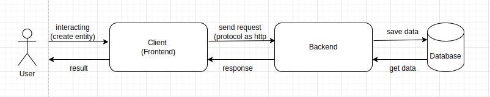
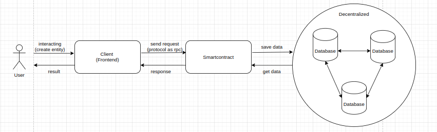

# Lesson 1: Introducing Web3 | Writing the first smart contract

Goal:

- Learners should be understand how to web3
- Learners can create their first smart contract

***Note**: This document is written for software developers, so the content will mainly be technical.* You should read up on what blockchain’s.

## What’s Web3 ?

In web2, for those who have developed projects (from frontend, backend, devops, management, etc.), most will understand the entire process of a product. I will summarize through the diagram as follows:



- Users will send requests such as creating or retrieving information on one or more objects through the interface (Frontend)
- The frontend will send requests to the backend via some protocol like http or grpc.
- The backend will retrieve information or save information in a place called Database (mysql, sql server, mongodb, vv…)

**So what's different about web3 than web2 ?**

In essence, the flow of operations is still the same, but in web2, storing data into the database will be done on one server (or multiple servers but independent of each other). The problem here is when data is collected in one place, it is very easy to be attacked or most simply, the admin can completely interfere with your data.

Web3 solves this problem by storing data distributedly (stores data in many places and has a mechanism to prevent editing once saved). 

And I'm going to redraw the flow a little bit of how a web3 application works:



As you can see, with decentralized data storage, moreover in web3, everything about data is transparent, anyone can see it. It has solved many problems such as finance, education, and health. The most prominent of these is the financial sector. 

The web3 financial industry has now entered its peak phase (exceeding the threshold of trillion dollars). The opportunities for software developers in the industry are huge, with salaries and bonuses compared to other developers  in the industry being much greater.

As you can see on the flow I drew, in addition to decentralized database storage, there are changes between the backend and smart contracts.

### **What’s Smartcontract ?**

As introduced, smartcontract is a compiler that helps automatically perform transactions or perform other actions without the intervention of a third party. This brings transparency, trust, and automation to transactions on the Web3.

For me personally, smart contracts are like web2 backends in terms of the purpose for which they were created, their functions, and how they work. Entities, data types, methods can be created and where data requests can be sent to the data store in web3. And finally and most importantly, if you want to become a web3 programmer, you must know at least one writing language for smartcontract. 

### **Writing the first smart contract**

Today there are many blockchain platforms being born with a variety of languages created to write smart contracts. The first language born to write smart contracts is Solidity (the easiest language to learn and document) and I will guide everyone to work with it in this basic series.

***Require Installed:*** 

- OS: Ubuntu | Macos | Window
- Npm
- Vscode IDE
- Hardhat
- Solc

**Deployment**

*Fact: You should be writing and test solidity on Remix.

1. First create a directory and initialize the project in the command line using npm

```bash
# Make and init dir
mkdir my-first-smart-contract

cd my-first-smart-contract

npm init -y

# Install harhat
npm i --save-dev hardhat
```

The most common way of developing smart contracts is to have a contracts folder where you’ll write your smart contracts, a script folder where you write the javascript functions to deploy the smart contract etc. 

```bash
mkdir contracts && mkdir scripts && touch hardhat.config.js

# hardhat config to interact with chain
```

1. First, in the `contracts` folder, create a file called `greet.sol` 

```solidity
// SPDX-License-Identifier: UNLICENSED

pragma solidity ^0.8.9;
import "hardhat/console.sol";

contract greet {
    uint256 amountOfGreetings;

    function greetings() public {
        amountOfGreetings +=1;
    }

    function getAmounLearn structure, datatype, method on soliditytOfGreetings() public view returns (uint256) {
        return amountOfGreetings;
    }
}
```

To understand it, you need to read structure, type, method solidity at https://docs.soliditylang.org/en/v0.8.25/

1. To interact with a smart contract, the smart contract’s code must be present on the blockchain. And, in order to do so, we must first compile it into byte code before deploying it to the blockchain, in this case the Goerli etheruem testnet blockchain. So, in the `scripts` folder, create a `deploy.js` file

```jsx
async function main() {
  const greetContractFactory = await ethers.getContractFactory("greet")
  const greetContract = await greetContractFactory.deploy()
  await greetContract.deployed()
  console.log("Contract deployed to:", greetContract.address)
}

main().catch((e) => console.log(e))
```

1. Setup network Goelri testnet at hathard.config.js

```jsx
module.exports = {
  solidity: "0.8.9",
  networks: {
    hardhat: {},
    goerli: {
      url: `$rpc goerli`,
      accounts: [$privatekey have balance on goerli],
    },
  },
}

```

1. Run and check result

```bash
npx hardhat run scripts/deploy.js --network goerli
```

### Homework

- Learn structure, datatype, method on solidity
- Run deploy successfully contract above
- Write a smartcontract to create a person with types: {id, name, age, assets} and send token to asset for that person.

### Video Help