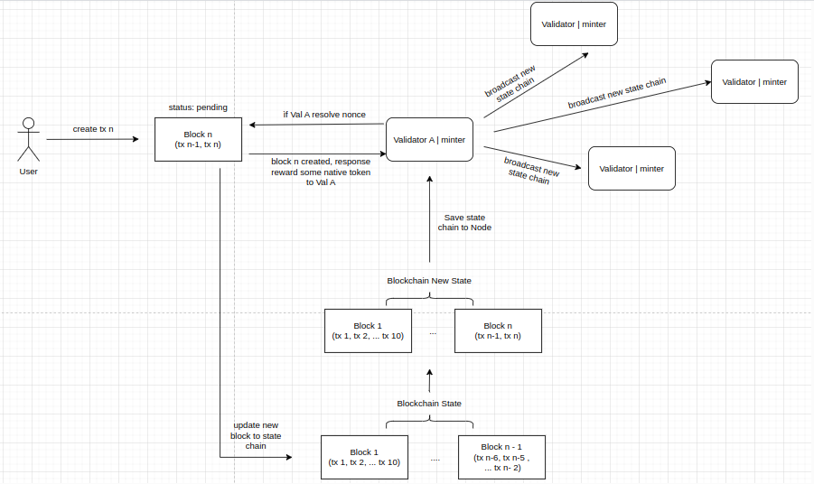
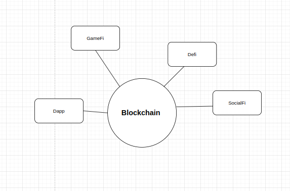

# Lesson 2: What’s Fungible Token? Create a Fungible Token

Goal:

- Learners should be understand what’s fungible token
- Learners can create a fungible token with solidity

***Note**: This document is written for software developers, so the content will mainly be technical.* You should read up on what blockchain’s.

## Blockchain operating mechanism



Most current blockchains (public chains) operate according to the mechanism that when storing data through transactions, fees will be charged (in native tokens). You can see the flow of activity from a user creating a transaction to verifying the new block decrypted by one val and then broadcasting the new state chain to other vals. 

A blockchain will serve as the infrastructure to develop decentralized applications (dApps as GameFi, Defi, SocialFi, vv…) on top. We can create dApps according to our problem and choose a blockchain as the infrastructure to build it. 



Ex: Suppose I want to create a decentralized game on the blockchain, I will have to build characters, a market to buy and sell items, etc., but payments to buy characters, buy items will which method to use? Developers on web3 have solved this problem for us by creating a smart contract standard called Fungible token, so what is it?

## What’s Fungible Token ?

As i mentioned about how to solve a mechanism to paypal on Dapp at Web3 for Creators. Fungible Token (ERC20) ensures that all tokens have the same properties, including that all tokens are fungible (any one token is exactly equal to any other token), and no tokens have special properties or rights associated with them.

→ Fungible token’s a standard struct created on Smartcontract. Read more about **Smartcontract** at previos lesson.

This means that for a token to follow the ERC-20 token standard, it must implement the following API methods and events:

- `totalSupply` - a method that defines the total supply of your tokens, and stops creating new tokens when the `totalSupply` limit is reached.
- `balanceOf` - a method that returns the number of tokens a wallet address contains.
- `transfer` - a method that transfers in a certain amount of tokens from the total supply and sends it to a user.
- `transferFrom` - a transfer method that transfers ERC-20 tokens between users
- `approve` - verifies whether a smart contract is allowed to allocate a certain amount of tokens to a user, considering the total supply.
- `allowance` - checks if a user has enough balance to send a token to another user

## Create a Fungible Token ?

***Require Installed:*** 

- OS: Ubuntu | Macos | Window
- Npm
- Vscode IDE
- Hardhat
- Solc

**Deployment**

*Fact: You should be writing and test solidity on Remix.

1. First create a directory and initialize the project in the command line using npm

```bash
mk my-token
cd my-token
npm init
```

1. Go to the `my-token` project root directory and type `mkdir contracts` and `mkdir scripts` into your command line to create two new folders that will organize your ERC-20 smart contracts and your deployment scripts

```bash
mkdir contracts
mkdir scripts
# 
cd contracts
touch Web3Token.sol
```

1. Copy and paste this code snippet based on the OpenZeppelin ERC 20 implementation

```solidity
//SPDX-License-Identifier: Unlicense
pragma solidity ^0.8.0;

import "@openzeppelin/contracts/token/ERC20/ERC20.sol";  // OpenZeppelin package contains implementation of the ERC 20 standard, which our NFT smart contract will inherit

contract AnyAxis is ERC20 {
    uint constant _initial_supply = 100 * (10**18);  // setting variable for how many of your own tokens are initially put into your wallet, feel free to edit the first number but make sure to leave the second number because we want to make sure our supply has 18 decimals

    /* ERC 20 constructor takes in 2 strings, feel free to change the first string to the name of your token name, and the second string to the corresponding symbol for your custom token name */
    constructor() ERC20("AnyAxis", "axis") public {
        _mint(msg.sender, _initial_supply);
    }
}
```

1. Navigation to scripts dir and create deploy.js file and paste it

```jsx
async function main() {
  const [deployer] = await ethers.getSigners();

  console.log("Deploying contracts with the account:", deployer.address);

  const weiAmount = (await deployer.getBalance()).toString();
  
  console.log("Account balance:", (await ethers.utils.formatEther(weiAmount)));

  // make sure to replace the "GoofyGoober" reference with your own ERC-20 name!
  const Token = await ethers.getContractFactory("AnyAxis");
  const token = await Token.deploy();

  console.log("Token address:", token.address);
}

main()
  .then(() => process.exit(0))
  .catch((error) => {
    console.error(error);
    process.exit(1);
});
```

1. Re read how to config goerli network at previos lesson and run it:

```bash
npx hardhat run scripts/deploy.js --network goerli
```

### Homework

- Run deploy successfully contract above
- Create your fungible token
- Send token you created to some different accounts

### Video Help